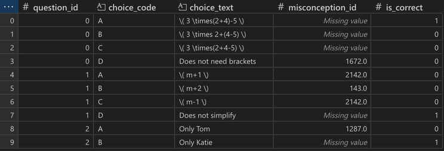
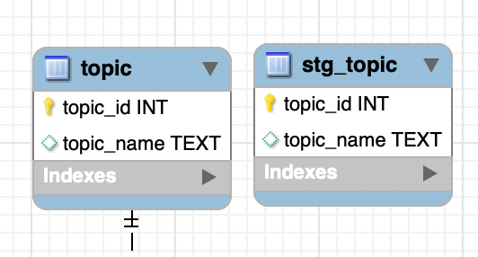

# I. MOTIVATION
Dù đã làm data được khá lâu, nhưng hầu hết việc tôi làm đều ở bước phân tích trở đi, tức là đã có sẵn một nguồn data, việc của mình chỉ là lấy được data đó ra, xử lí và phân tích. Tôi chưa từng thực sự tạo ra và quản lí một database đúng nghĩa. Và rồi dạo gần đây, các dự án của công ty bắt đầu thu thập được rất nhiều data, vấn đề  bắt đầu phát sinh từ đây.

Trước đến giờ tôi vẫn chỉ quản lí ở các file CSV, EXCEL, hay cùng lắm là nén thành các định dạng lưu trữ hiệu quả hơn như SQLITE. Với mỗi một yêu cầu phân tích dữ liệu tôi lại lưu trữ ở một vài files, trong một vài folders, và rồi khi data lớn dần mỗi ngày, data phân tán loạn đủ mọi nơi. Tôi nghĩ mình cần một thiết lập đồng nhất cho mọi data từ nay về sau, cứ có data là phải xử lí và lưu trữ lại theo định dạng cố định. Và thế là tôi nghiên cứu thử database, data warehouse, và cả data lake. Nhưng với lượng data không phải đến cỡ BIG DATA, và cũng chỉ mới bắt đầu nghiên cứu, database mới là bài học vỡ lòng mà tôi cần vượt qua.

# II. CASE STUDY
Trong suốt quá trình nghiên cứu tôi đã ngộ ra khá nhiều điều thú vị mà mình chưa hiểu sâu về data nếu chỉ làm ở mảng phân tích, phải tự tay thiết kế database mới được. Vì không thể chia sẻ thông tin ở các dự án đang làm tại công ty, nên tôi đành lấy một data mà tôi thấy khá thu vị, vừa thuộc lĩnh vực giáo dục tôi quen thuộc, vừa thể hiện được các concept, khái niệm tôi học được. Chính là dataset một cuộc thi của Eedi trên Kaggle (Hic, không lưu nguồn nhưng lên Kaggle cũng có khá nhiều bộ của Eedi mà bạn có thể lấy), hoặc có thể xem lại bộ data tại Github của tôi (có edit vài chỗ để tiện lưu vào MySQL database hơn).

https://github.com/Neo-Nguyen-95/DA30_database

## 2.1 Entity, Relationship & ER diagram
Trước khi tạo ra database, tôi sẽ cần xác định các Entity table và Relationship (Junction) table. Tôi nghĩ wow, trước giờ cứ EDA loạn xì ngậu để tìm ra nguyên lí và sự kết nối giữa các bảng, hoá ra các bảng cũng cần có mục đích riêng của nó. Entity table để mô tả các đối tượng (và chỉ tập trung mô tả đối tượng), các đối tượng liên kết với nhau như thế nào thì sẽ là các relationship table.

Sau khi xác định được sơ lược các bảng rồi, tôi bắt đầu phác hoạ ra Entity Relationship (ER) Diagram, theo một vài cách khác nhau. Với project phức tạp thì tôi sẽ vẽ ER diagram bằng MySQL trước, sau đó tạo ra Database và dùng forward engineering để lấy SQL code. Nhưng với dự án đơn giản tôi muốn làm ngược lại (để luyện SQL là chính), tạo bằng SQL code rồi export ra ER diagram bằng reverse engineering. Kết quả sau một vài cân nhắc chỉnh sửa được như sau:

Hình 1. ER diagram của data từ Eedi

Lần đầu tiên nhìn thấy ER diagram tôi đã thấy sự kết nối giữa các table thật rõ ràng và rất khoa học. Các đường liên kết không chỉ cho thấy sự liên kết giữa các bảng mà còn nói lên loại liên kết đó là gì (1-to-1, 1-to-many, hay many-to-many).

## 2.2 Normalization
Trong quá trình thiết kê database tôi cũng học thêm được một concept mới đó là normalization. Tôi nhận ra kể cả với data mình download từ Eedi, data vẫn chưa đạt đến các chuẩn normalization, mà giống như kiểu mình tạo bảng trên excel, cho dễ nhìn, dễ hiểu là chính, chứ không tối ưu hoá cho việc lưu trữ và xử lí dữ liệu. 

Ví dụ như ảnh bên dưới, có 4 cột thể thiện phần text cho các đáp án A, B, C, D của mỗi câu hỏi. Các cột này vì 4 cột answer_x_text được tính các nhóm trùng lặp, đều thể hiện một attribute của đối tượng, đo là answer_text.

Hình 2. Data gốc không thoả mãi điều kiện 1st Normalization Form (1NF)
Vậy nên tôi sẽ cần xử lí dữ liệu trước khi nạp vào database, đây sẽ là một relationship table vì thể hiện sự liên kết giữa question, choice (text), và misconception. (Chi tiết trong file data_processing.ipynb)

Hình 3. Data sau khi normalized
Lúc này data mới sẵn sàng để nạp vào database.

## 2.3 Staging table
Staging table cũng là một khái niệm mới với tôi. Trong ER diagram (Hình 1), bên cạnh các bảng chính, bạn có thể thấy các staging table (stg_***), tôi sẽ zoom in vào bảng topic trong Hình 4. Staging này là 1 bước đệm trước khi chèn data vào bảng chính với một vài đặc tính thú vị:

Tác dụng đầu tiên mà tôi thấy ngay đó chính là việc tôi sẽ được thử insert data vào bảng theo các loại biến mà tôi đã thiết lập cho từng attribute (VARCHAR, TEXT, INT, ...) để xem bảng có nhận không, nếu không nhận thì tôi cần xem lại quá trình xử lí data. Sao cho để lúc insert, các cột phải đúng định dạng cho phép. Sau khi staging table đã thoả mãn, lúc này tôi sẽ cập nhật data sang bảng chính.

Ngoài ra, tôi ngộ thôi được một tác dụng của staging table, đó chính là có thể tự do chèn data mà không bị ảnh hưởng bởi ràng buộc. Thường các bảng entity sẽ được refer đến các FOREIGN KEY ở các bảng khác, nên bảng sẽ k thể bị xoá và tái thiết lập nếu con kiểu chèn data là if_exists = 'replace', chỉ có thể chèn kiểu if_exists = 'append', tức là thêm tiếp data mới, và vẫn lưu data cũ. Như vậy các bảng chính này sẽ bị lặp data rất nhiều. Thay vì thế, ta sẽ luôn chèn data vào staging table, sau đó, từ staging table update qua bảng chính, cứ trùng key thì sẽ update, k trùng thì tạo mới, hình thức này rất hiệu quả để cập nhật data (còn goi là upsert, có lẽ là update & insert).

Hình 4. Table và staging table của topic

# III. CONCLUSION
Trước khi biết mỗi SQL là SELECT - FROM - WHERE, giờ đã biết các thao tác với DATABASE, TABLE, lúc này mới thực sự nhận ra để nói là biết SQL thì cần qua được các khoá về database cái đã. Khi nói về data analysis, mọi người có vẻ thường chỉ dừng lại ở các thao tác cơ bản để hiểu về data, nhưng tôi thấy việc biết cách database được tạo lên như thế nào giúp ta có cảm nhận cực kì thấu đáo về data và cũng giúp chúng ta có thêm một lưu ý trong quá trình xử lí data (chính là sự hữu ích của khái niệm normalization)

# IV. FURTHER RESEARCH
Learn from CS50 course of harvard university (LINK)
INT 1010: Concepts in Computing / 7: Databases (LINK)

